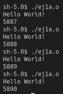
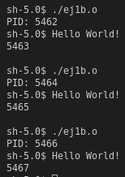
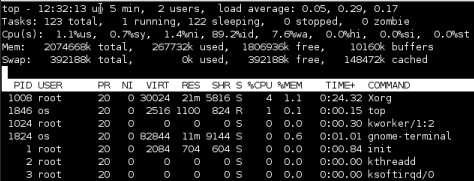
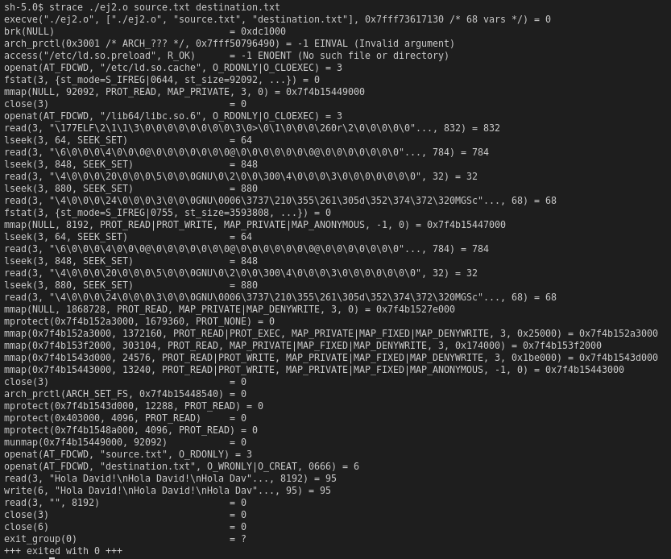
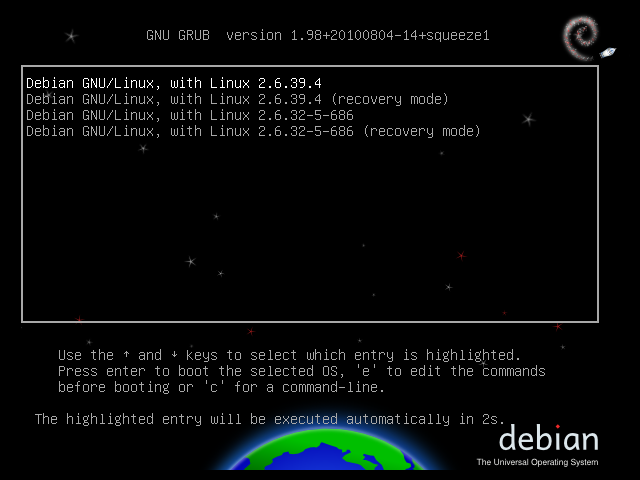
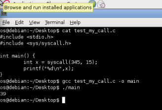

# Laboratorio #1 - Sistemas Operativos
## Josue Valenzuela 171001

## Ejercicio 1
### Instrucciones de compilacion y ejecucion
#### Compilacion
```
$ gcc ej1a.c -o ej1q.o
$ gcc ej1b.c -o ej1b.o
```
#### Ejecucion
```
$ chmod +x ej1a.o ej1b.o
```
```
$ ./ej1a.o
```
#### Resultado

```
$ ./ej1b.o
```
#### Resultado

### ¿por  qué  aparecen  números diferentes cada vez?
Los numeros que se muestran son los identificadores de procesos, cada vez que se ejecuta es un proceso distinto, por lo que tendra un identificador distinto.
### ¿Por  qué  aparecen  dos  números distintos a pesar de que estamos ejecutando un único programa?
La llamada a sistema `fork` crea un nuevo proceso (child process) que corre concurrentemente con el proceso que realizo la llamada. La llamada `execl` reemplaza el proceso actual, con un proceso nuevo. El segundo programa esta creando un nuevo proceso para poder ejecutar el primer programa, aunque se ejecutan desde el 'mismo' punto de entrada son 2 procesos distintos los que se ejcutan.
### ¿Por qué el primer y el segundo números son iguales?
Por que si el valor de retorno de `fork` no es 0, ha regresado al proceso padre (Donde se realizo la llamada) y al ejecutarse `execl` reemplaza el proceso padre, con el programa que se pasa en los parametros.
### ¿Para  qué  sirve  este proceso  (con  identificador  1)?


El proceso init es el padre de todos los procesos, es primer proceso en ejecutarse cuando una computadora es iniciada, y es el encargado de crear los procesos hijos en los archivos de configuracion.

## Ejercicio 2
### Instrucciones de compilacion y ejecucion
#### Compilacion
```
$ gcc ej2.c -o ej2.o
```
#### Ejecucion
```
$ chmod +x ej2.o
$ ./ej2.o source.txt destination.txt
```
##### Ejecucion con strace
```
$ chmod +x ej2.o
$ strace ./ej2.o source.txt destination.txt
```
###### Resultado

### ¿Por qué la primera llamada que aparece es execve?
La llamada `execve` ejecuta el programa que pasa en los argumentos (Eejecutable binario, o script con shebang), este es el punto de entrada donde se ejecuta el archivo de fuente.
### ¿Qué significan los resultados (números que están luego del signo ‘=’)?
El valor despues del \`=\` son el valor de retorno de las llamadas. 
- En el caso `open` el valor de retorno es el 'file descriptor', numero de referencia al archivo que se abre.
- En el caso de `read` el valor de retorno es el numero de bytes que se leyeron al buffer del file descriptor.
- Para `write`, similar a `read`, retorna el numero de bytes que se escribieron al file descriptor.
- En el caso de `close` retorna si el resultado de la llamada fie exitoso. 0 en caso de exito, -1 en caso de error.
### ¿Por qué entre las llamadas realizadas por usted hay un read vacío?
El read vacio es cuando se llega al final del archivo (EOF)
### Identifique  tres  servicios  distintos  provistos  por  el  sistema  operativo  en  este `strace`.
1. `lseek`: Cambia el offset que esta registrado en la descripcion del archivo. En el caso de la llamada `lseek(3, 64, SEEK_SET)` cambia el offset del file descriptor 3 a 64 byte, dado por el modo `SEEK_SET`.
2. `mmap`: crea una nueva asignación en el espacio de direcciones virtuales de proceso de llamada. En el caso de `mmap(NULL, 92092, PROT_READ, MAP_PRIVATE, 3, 0) = 0x7fc456074000` crea una nueva asignacion de memoria de tamaño 92092, en modo lectura, privado, en el file descriptor 3, sin offset, el valor de retorno `0x7fc456074000` es la direccion de memoria donde se creo la asignacion.
3. `munmap`: A diferencia de `mmap` en lugar de crear una asignacion de memoria esta la elimina. En el caso de la llamada `munmap(0x7fc456074000, 92092)`. Elmina la asignacion de memoria en la direccion de memoria `0x7fc4560740000` de tamaño 92092.

## Ejercicio 3
### ¿Qué ha modificado aquí,la interfaz de llamadas de sistemao el API?
Se ha modificado la API del sistema, ya que se ha agregado a la lista de funciones que se pueden usar en el sistema, pero no es vital para el funcionamiento, ni forma parte obligatoriamente de las llamadas a sistema.
### ¿Por qué usamos el número de nuestra llamada de sistema en lugar de su nombre?
Al no ser agregada a la interfaz de llamadas de sistema, nose encuentra en la lista que pueden ser llamadas solamente por el nombre.
### ¿Por qué las llamadas de sistema existentes como `read` o `fork` se pueden llamar por nombre?
Estas forman parte de la interfaz de las llamadas a sistemas, lo cual agrega los nombres a la lista de llamadas reservadas que pueden llamarse solamente con el nombre.

### Ejecucion



El numero que se selecciono fue 24. 24 + 15 = 39.